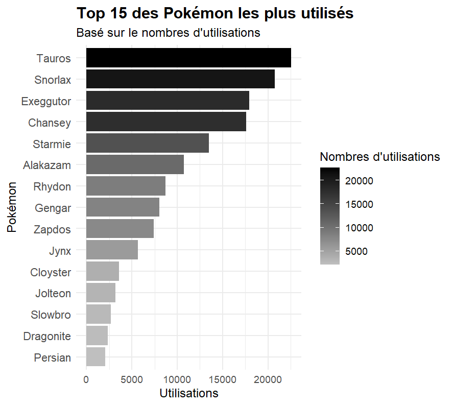
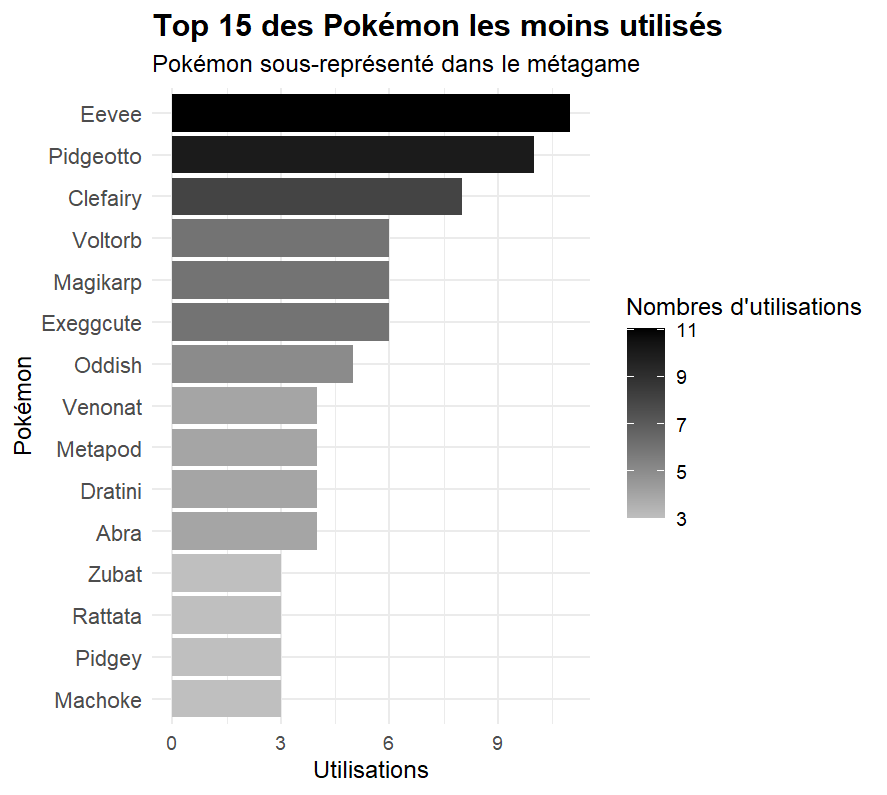
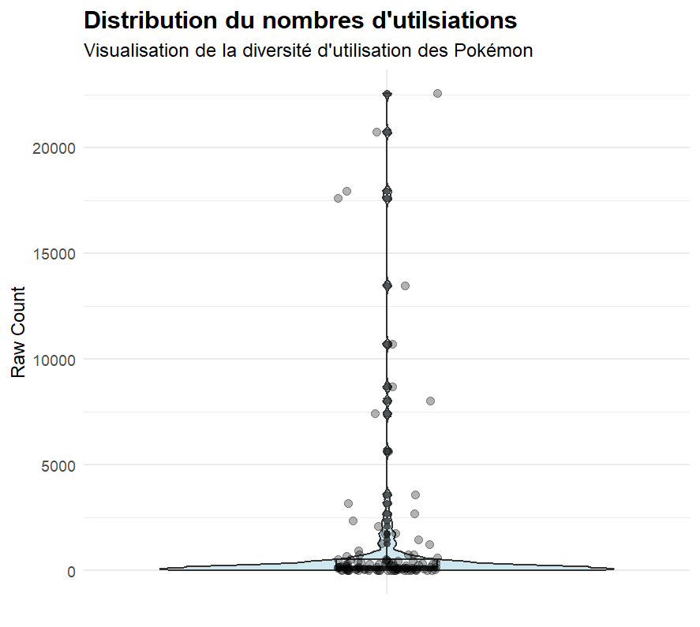

# Interpretation des visualisations obtenues

## Question 1 : Quels Pokémons sont les plus utilisés, et lesquels sont sous-représentés dans le métagame étudié ? (En utilisant le dataset Smogon)

En utilisant le dataset Smogon ('gen1ou-0.txt') ou sont présent tout les pokémons de la première génération avec différentes statistiques, leurs types, attaques, etcetera..., j'ai pu obtenir deux visualisations basiques permettant de répondre à la question.

### Graphique n°1 : Top 15 des pokémons les plus représentés

On peut remarquer que parmis les 15 pokémons les plus joués, il n'y a aucun Pokémon légendaire. On retrouve dans le top 5 :

- Tauros : 22.570 utilisations
- Ronflex : 20.733 utilisations
- Noadkoko : 17.945 utilisations
- Leveinar : 17.597 utilisations
- Staross : 13.484 utilisations

On peut aussi remarquer que ces pokémons sont tous des évolutions maximales. Enfin on peut aussi remarquer que la différence d'utilisations entre le top 4 et le reste du top 15 est assez élevé.

### Graphique n°2 : Top 15 des pokémons les plus sous-représentés

On peut remarquer que parmis les 15 pokémons les moins joués, il n'y a aucun Pokémon légendaire. On retrouve dans le top 5 :

- Machopeur : 3 utilisations
- Roucool : 3 utilisations
- Rattata : 3 utilisations
- Nosferapti : 3 utilisations
- Abra : 4 utilisations

On peut aussi remarquer que ces pokémons sont presques tous des premières évolutions. Enfin on peut aussi remarquer que la différence d'utilisations entre le top 15 des Pokémon les plus sous-représentés est plutôt faible (+/-8), comparé à celle du top 15 des Pokémon les plus utilisés.

### Graphique n°3 : Distributions de l'utilisations des Pokémons

Sur ces deux graphiques, on peut voir un peu mieux la répartition de l'utilisation des Pokémons. On remarque à l'oeil nu que l'immense majorité des Pokémons ne sont pas (ou presque) utilisé, et qu'il y a une minorité (~10 Pokémons) qui sont joué presque tout le temps.
